# 🛡️ Threat Intelligence Pipeline: OpenCTI ➜ Splunk ➜ Zeek/Snort

## 📌 Overview

This project demonstrates a **threat intelligence pipeline** leveraging **OpenCTI** to feed **Indicators of Compromise (IOCs)** into detection platforms such as **Splunk**, **Zeek**, and **Snort**. 

It walks through the process of:
- Creating fake IOCs in OpenCTI
- Streaming those IOCs into Splunk
- Detecting simulated malicious activity using Snort and Zeek
- Visualizing and alerting on IOC matches within Splunk
- Sending sightings back to OpenCTI

The entire setup is containerized using **Docker** to maintain portability and reproducibility.

---

## ⚙️ Installation & Setup

### 🐳 Docker-Based Lab Environment

This lab uses **Docker** containers to host each of the following components:
- **Splunk** (with OpenCTI Add-on)
- **OpenCTI** (Threat Intelligence Platform)
- **Zeek** (Network Traffic Analyzer)
- **Snort** (Intrusion Detection System)
- Two Linux VMs:
  - **Attacker VM** – Simulates malicious traffic.
  - **Victim VM** – Monitored by Zeek/Snort.

---

### 1️⃣ Splunk Installation

To enable integration with OpenCTI, Splunk must run in its **own container**.

> 📁 In this repository, refer to the `splunk/` folder for the correct `docker-compose.yml`.

> ⚠️ **Important Note:** The latest Splunk images may cause **KV store errors** which break the OpenCTI indicator dashboard.  
> ✅ **Solution:** Use **Splunk version `9.0.5`**, which mitigates this issue.

---

### 2️⃣ OpenCTI Installation

OpenCTI also runs in a Docker container.

> 📁 Refer to the `OpenCTI/` folder for:
> - `docker-compose.yml`
> - `.env` (must be configured accordingly)

Once the containers are up and running, OpenCTI will be accessible via `http://<your-local-ip>:8080`.

---

### 3️⃣ OpenCTI Add-on for Splunk

After Splunk is up and running:

1. Install the **OpenCTI Add-on** from the Splunk UI.
2. **Issue:** The add-on requires an HTTPS URL, but OpenCTI is typically served over HTTP.
3. **Workaround:** Manually configure the add-on inside the container:

```bash
docker exec -it splunk /bin/bash
sudo vi etc/apps/TA-opencti-add-on/local/ta_opencti_add_on_settings.conf
```

Add the following manually:

```ini
[proxy]
proxy_password = ******

[additional_parameters]
opencti_api_key = <OPENCTI API KEY>
opencti_url = http://<LOCAL SERVER IP>:8080
```

This establishes the integration between Splunk and OpenCTI.

### 4️⃣ Create Indicators in OpenCTI
From the OpenCTI UI:

Navigate to "Observables" > "Indicators"
Add fake IOCs such as:
IPv4 addresses
Domains
URLs

These will serve as the malicious artifacts for detection.

### 5️⃣ Create a Live Stream in OpenCTI
To enable data flow to Splunk:

Go to Settings > Data Sharing > Live Streams

Create a new stream filtering on:
ipv4
domain
url
indicator

Start the stream and copy the Stream ID

### 6️⃣ Configure Splunk Input for OpenCTI Stream
In the Splunk UI:

Create a new Input under the OpenCTI Add-on

Enter the Stream ID obtained earlier

✅ You should now see the OpenCTI Dashboard in Splunk, reflecting the indicators you've created.

### 7️⃣ Install Snort & Zeek
On your Victim VM:

Install Snort and Zeek
Configure rules to detect IOCs (e.g., fake C2 IPs/domains)

On the Attacker VM:
Simulate traffic using:
curl to fake C2 IP
nslookup to fake domains
nmap to simulate port scans

### 8️⃣ Configure Splunk Forwarding
Ensure Snort and Zeek logs are forwarded to Splunk:

Set up Universal Forwarder or syslog ingestion
Make sure to create appropriate indexes in Splunk before ingestion

## ✅ Demonstration of Pipeline
Here's the order in which the lab demonstrates IOC detection and correlation:

### 🔍 1. OpenCTI Threat Intelligence with Fake IOCs
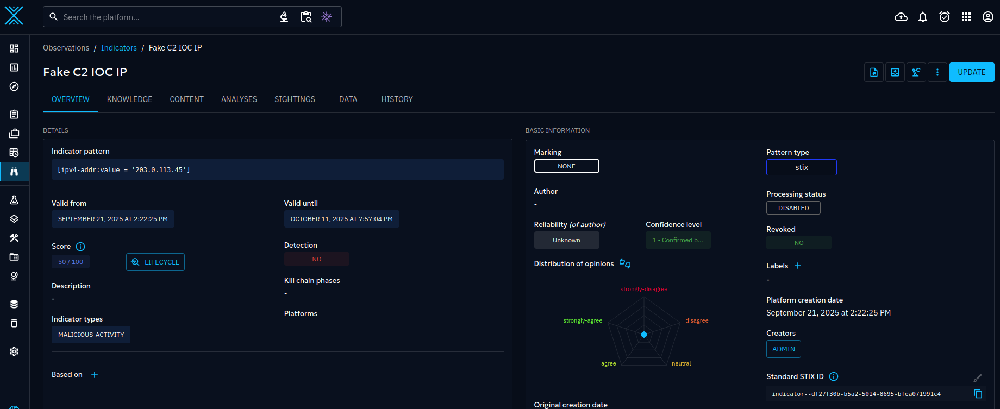
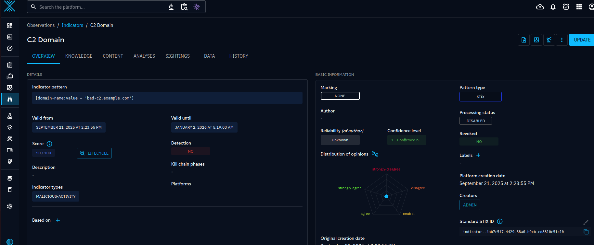

### 📈 2. Splunk Query Results Matching IOCs
Matches on fake C2 IPs
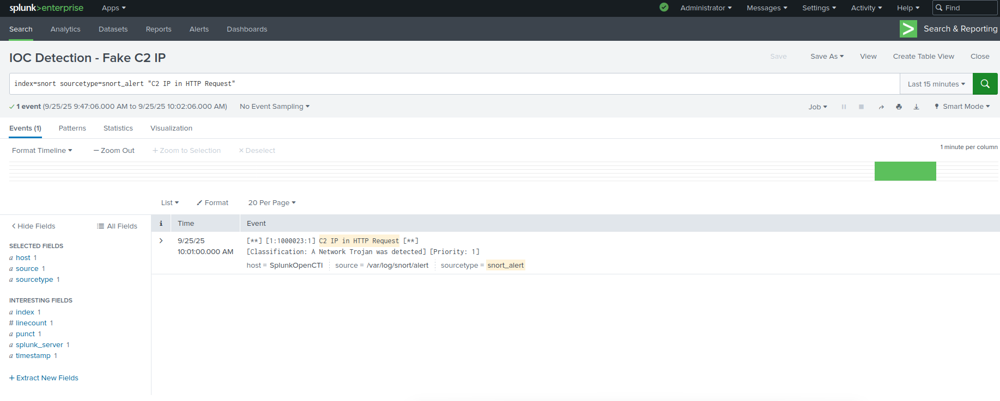

DNS queries to fake domains
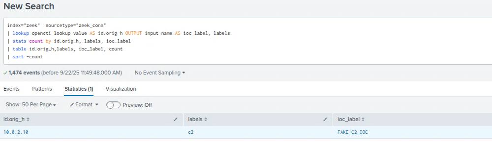
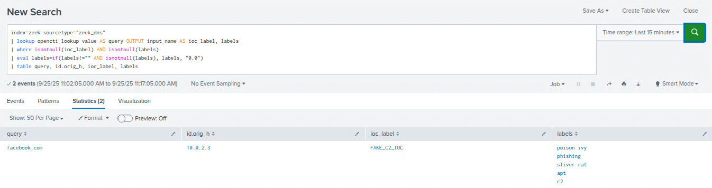


### 🚨 3. Snort or Zeek Log Samples with IOC Hits
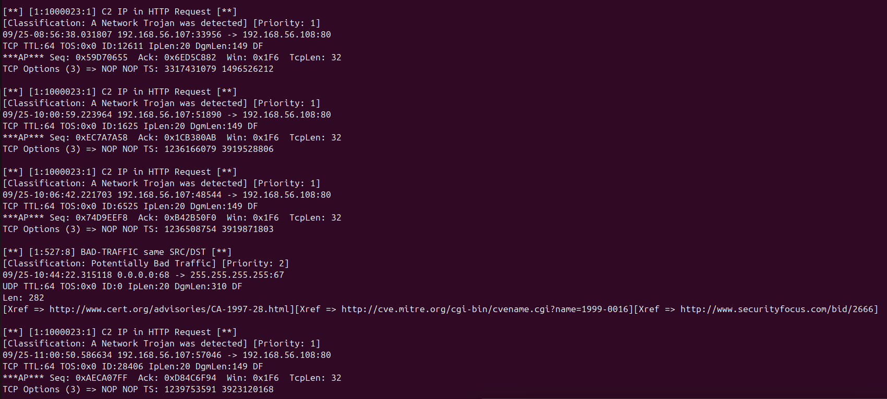

### 🔁 4. OpenCTI Sighting Created from Splunk
__Creating Alerts__


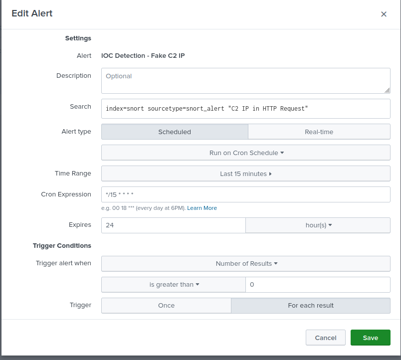
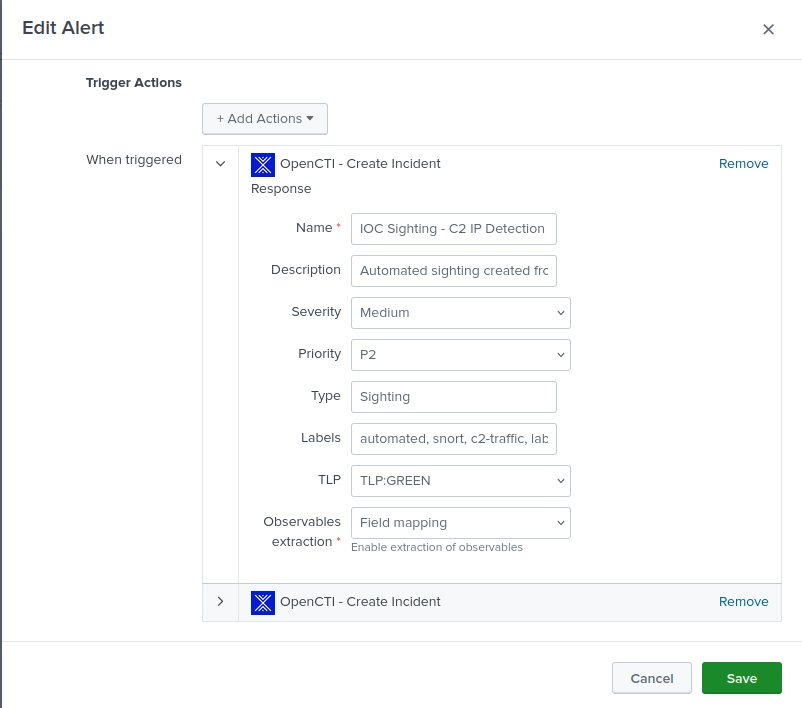

__OpenCTI Sightings__
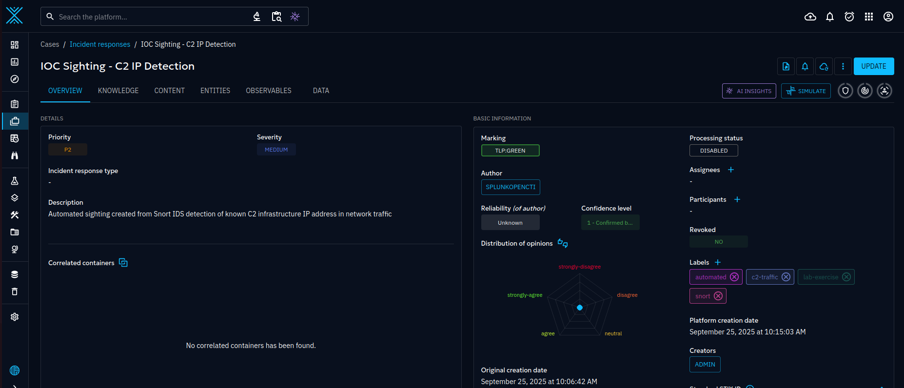
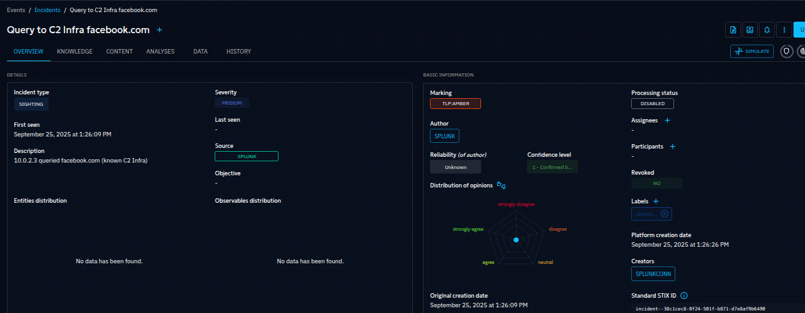
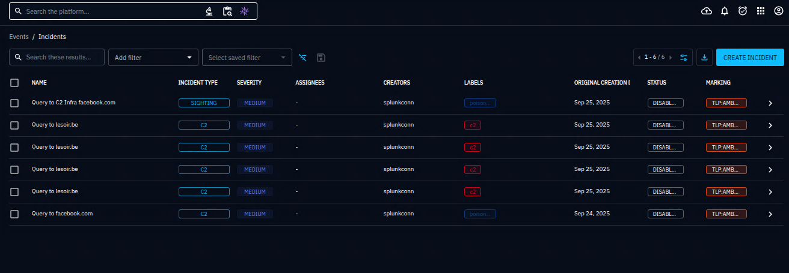

## 🧠 Conclusion
This lab demonstrates a working end-to-end threat intelligence pipeline:

OpenCTI serves as the central IOC management platform

Splunk ingests threat intelligence and logs from detection tools

Zeek and Snort provide low-level detection of malicious traffic

Sightings are pushed back into OpenCTI for threat context

This approach provides real-time detection, correlation, and threat enrichment across multiple platforms in a modular, containerized environment.

***BONUS***
<ADD CALDERA DOCUMENTATION HERE>
