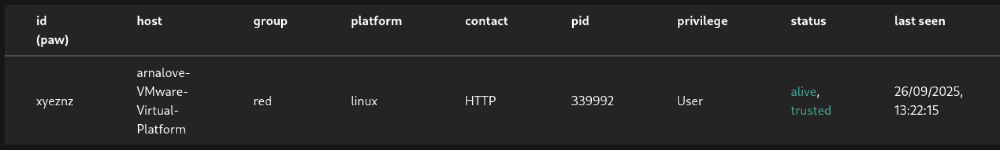
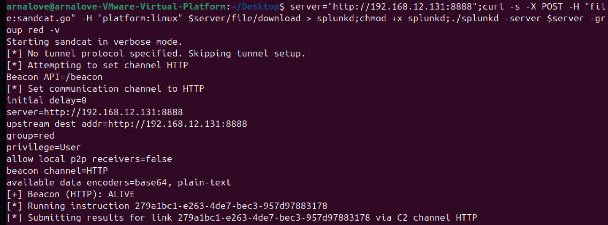
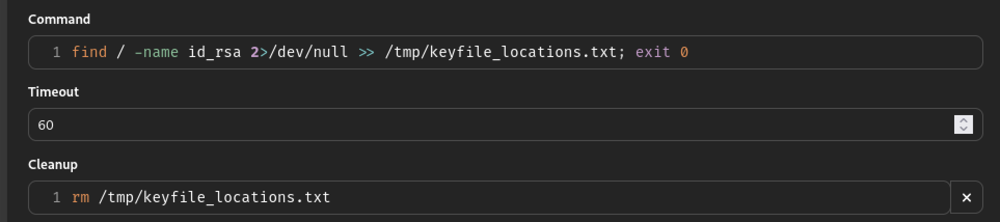
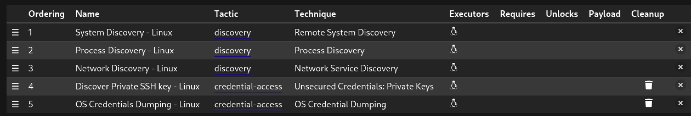
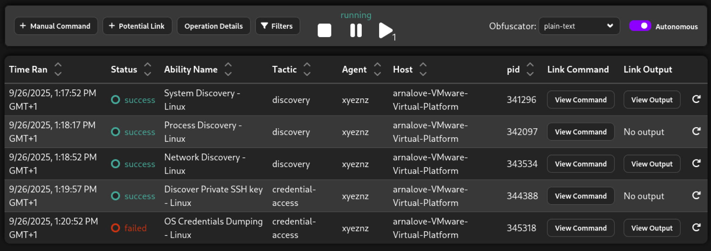

# Threat Intelligence Pipeline: OpenCTI ➜ Splunk ➜ Zeek/Snort 
## I. Rationale & Scope

This project outlines a **threat intelligence pipeline** designed to push **Indicators of Compromise (IOCs)** from the central **OpenCTI** platform into real-time detection systems like **Splunk**, **Zeek**, and **Snort**. 
The walkthrough covers the full cycle: 
* Creating test IOCs in OpenCTI.
* Streaming these IOCs directly into Splunk's analytics engine.
* Simulating malicious network activity.
* Detecting the activity using Snort and Zeek. 
* Visualizing IOC matches in Splunk and generating alerts.
* Closing the loop by sending "sightings" (confirmations of detection) back to OpenCTI.

The entire environment is built using **Docker** for guaranteed portability and immediate reproducibility.

---
## II. Installation & Lab Setup

### Containerized Lab Components

The lab is composed of the following services, each running in a dedicated **Docker** container:
* **Splunk:** The core SIEM/Analytics platform (with the OpenCTI Add-on).
* **OpenCTI:** The Threat Intelligence Platform (TIP).
* **Zeek:** Network Traffic Analyzer. * **Snort:** Intrusion Detection System (IDS).
* **Two Linux VMs:**
	* **Attacker VM:** Used to generate simulated malicious traffic.
	* **Target VM:** The host monitored by Zeek and Snort.

---
### 1. Splunk Setup 
Splunk must be run in a container to facilitate its integration with OpenCTI. 

> The necessary `docker-compose.yml` is located in the `splunk/` directory. 
> **Critical Version Note:** Latest Splunk images often cause **KV store errors** which break the OpenCTI indicator dashboard functionality.
> **Resolution:** Use **Splunk version `9.0.5`** to avoid this known issue.

---

### 2. OpenCTI Setup
OpenCTI is deployed as a standard Docker stack.
> Configuration files, including `docker-compose.yml` and the required `.env` file, are located in the `OpenCTI/` directory. 

Once the stack is running, OpenCTI will be accessible via `http://<your-local-ip>:8080`.

---

### 3. Linking OpenCTI to Splunk (Add-on Configuration) 

After verifying Splunk is operational:

1. Install the **OpenCTI Add-on** via the Splunk UI.
2. **Problem:** The add-on typically requires an HTTPS URL, but our OpenCTI instance uses HTTP. 
3. **Workaround (Manual Configuration):** Modify the configuration file inside the Splunk container to force the HTTP connection: 

Manually inject the connection details: 
```ini 
[proxy] proxy_password = ******
[additional_parameters]

opencti_api_key = <OPENCTI API KEY>
opencti_url = http://<LOCAL SERVER IP>:8080
```
This establishes the integration between Splunk and OpenCTI.

### 4. Create Indicators in OpenCTI
From the OpenCTI UI:

* Navigate to **"Observables"** > **"Indicators"**.
* Add fake IOCs such as:
    * IPv4 addresses
    * Domains
    * URLs

These will serve as the malicious artifacts for detection.

### 5. Create a Live Stream in OpenCTI
To enable data flow to Splunk:

* Go to **Settings** > **Data Sharing** > **Live Streams**.
* Create a new stream filtering on:
    * ipv4
    * domain
    * url
    * indicator

* Start the stream and copy the **Stream ID**.

### 6. Configure Splunk Input for OpenCTI Stream
In the Splunk UI:

* Create a new **Input** under the OpenCTI Add-on.
* Enter the **Stream ID** obtained earlier.

The **OpenCTI Dashboard** in Splunk should now be visible, reflecting the indicators you've created.

### 7. Install Snort & Zeek
On your **Target VM**:

* Install **Snort** and **Zeek**.
* Configure rules to detect IOCs (e.g., fake C2 IPs/domains).

On the **Attacker VM**:

* Simulate traffic using:
    * `curl` to fake C2 IP
    * `nslookup` to fake domains
    * `nmap` to simulate port scans

### 8. Configure Splunk Forwarding
Ensure Snort and Zeek logs are forwarded to Splunk:

* Set up **Universal Forwarder** or **syslog ingestion**.
* Make sure to create appropriate indexes in Splunk before ingestion.

---

## III. Demonstration of Pipeline
Here's the order in which the lab demonstrates IOC detection and correlation:

### 1. OpenCTI Threat Intelligence with Fake IOCs


### 2. Splunk Query Results Matching IOCs
Matches on fake C2 IPs


DNS queries to fake domains


### 3. Snort or Zeek Log Samples with IOC Hits


### 4. OpenCTI Sighting Created from Splunk
__Creating Alerts__


__OpenCTI Sightings__


---

## Conclusion
This lab demonstrates a working end-to-end threat intelligence pipeline:

* OpenCTI serves as the central IOC management platform.
* Splunk ingests threat intelligence and logs from detection tools.
* Zeek and Snort provide low-level detection of malicious traffic.
* Sightings are pushed back into OpenCTI for threat context.

This approach provides real-time detection, correlation, and threat enrichment across multiple platforms in a modular, containerized environment.

***

# IV. Adversary Emulation with MITRE Caldera

## Overview

**Caldera** is an open-source cybersecurity platform developed by MITRE and designed to automate adversary emulation, red teaming, and defensive testing. It provides a flexible framework where security teams can simulate real-world attack techniques—based on the **MITRE ATT&CK framework**—against their environments to evaluate detection and response capabilities. By using plug-ins and customizable agents, Caldera enables users to test specific tactics, techniques, and procedures (**TTPs**) in a controlled way, helping organizations identify gaps, strengthen defenses, and continuously improve their security posture without requiring manual execution of every test.

## Installation

```bash
git clone [https://github.com/mitre/caldera.git](https://github.com/mitre/caldera.git) --recursive
cd caldera
docker build --build-arg WIN_BUILD=false . -t caldera:server
docker run -p 8888:8888 caldera:server --insecure
```

**Credentials**: `admin` / `admin` (default credentials)

## The Custom Ability Stack 
Caldera's default ability presets are largely **Windows-centric**. For this project, a **custom, Linux-focused ability stack** was developed specifically. This minimal set is designed and used exclusively for demonstrating basic TTP execution on the target VM.
### Initial Discovery (T1057, T1082, T1016) 
* **T1057** | Process Discovery via `ps >> /tmp/loot.txt; ps aux >> /tmp/loot.txt` 
* **T1082** | System Discovery (custom) via `uname -a ; lsblk ;` 
* **T1016** | Network Discovery via `ip addr ; ip neigh ; netstat ;`
### Credential Access (T1003, T1552) 
* **T1003** | OS Credentials Dumping via `/etc/passwd`, `/etc/shadow` 
* **T1552** | Discover Private SSH keys via `find / -name id_rsa`
### Exfiltration (T1048) 
* **T1048** | Exfiltrate Data HTTP via `curl` 
## The Caldera Components 
### Agent 
A lightweight software component that runs on a target system and executes commands sent by the Caldera server. It acts like a simulated attacker's foothold, allowing the platform to carry out various attack techniques safely for testing purposes. 
 
 
*An agent and its related script running on the target* 
### Ability 
A specific action or tactic that an agent can perform, such as collecting files, creating processes, or escalating privileges. Each ability is mapped to a **MITRE ATT&CK technique**, making it easy to simulate realistic adversary behavior. 
### Adversary 
A predefined or custom profile that combines multiple abilities to mimic the behavior of a real-world attacker. Adversaries allow teams to simulate complex attack campaigns without manually triggering each ability. 
 
 
*The custom Ability stack and the detailed Discover Private SSH Key ability*
### Operation 
The execution of an adversary plan against one or more agents. It orchestrates the selected adversary's abilities in a controlled sequence, enabling security teams to assess how well their defenses detect and respond to attacks. 
 
*The running Operation and its Ability stack*